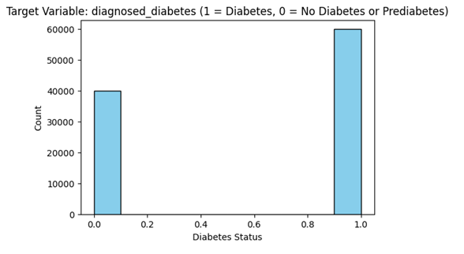
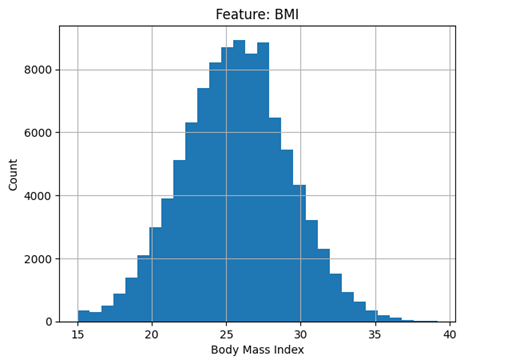
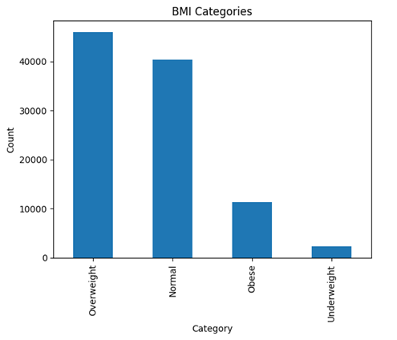

# applied-ml-aanchal

# Diabetes Health Indicators Data Analysis

This project contains my analysis and proposed transformations for the [Diabetes Health Indicators Dataset](https://www.kaggle.com/datasets/mohankrishnathalla/diabetes-health-indicators-dataset) on Kaggle. The analysis focuses on examining feature distributions, handling missing values, and proposing useful transformations.

## Overview

Started by loading the dataset and reviewing its structure and columns. Then examined summary statistics and visualized histograms to understand the distribution of each feature. This allowed me to identify patterns, skewed distributions, and potential features that may require transformation.  

---

## Target Variable

The target variable for this analysis is `diagnosed_diabetes`. There are no missing values in this column. The histogram shows a binary distribution, with a larger number of instances labeled `1` (diabetes) compared to `0` (no diabetes). This distribution provides a clear distinction between the two classes, which is useful for predictive modeling.  

  
---

## Input Feature

For this analysis, I focused on **BMI (Body Mass Index)** as an important input feature. There are no missing values in this column. The histogram of BMI shows an approximately normal (bell-shaped) distribution, with most values between 20 and 30 and a few extreme outliers.

  
---

## Proposed Transformation

To enhance the analysis, I created a new feature called **BMI Category** by converting continuous BMI values into categories. This helps in identifying trends in diabetes prevalence across different BMI ranges and makes the dataset more interpretable. The BMI categories are:

- BMI < 18.5 → Underweight  
- BMI 18.5–24.9 → Normal weight  
- BMI 25–29.9 → Overweight  
- BMI ≥ 30 → Obese  

This transformation allows for easier visualization and analysis of the relationship between BMI and diabetes. 

  